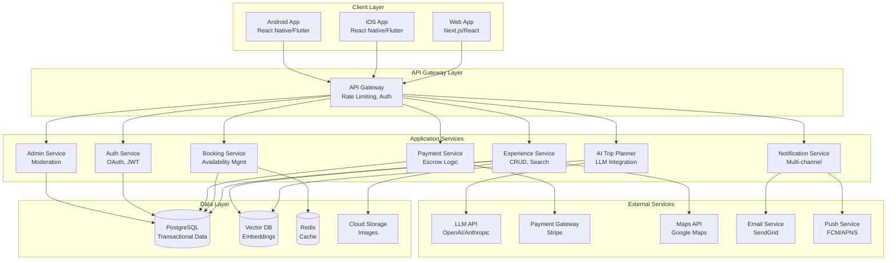

# Design Document: AI-Powered Local Tourism Marketplace

## Overview

The AI-Powered Local Tourism Marketplace is a comprehensive platform connecting travelers with authentic local experiences through AI-driven trip planning. The system consists of web and mobile applications (iOS and Android) that enable travelers to describe their travel desires in natural language and receive personalized, bookable itineraries.

### Core Value Proposition

- Travelers receive AI-generated personalized itineraries from natural language descriptions
- Local guides monetize their expertise through a trusted marketplace
- Secure escrow payment system protects both parties
- Multi-platform access (web, iOS, Android) with feature parity

### System Boundaries

The platform includes:
- Web application (Next.js, React, TypeScript, TailwindCSS)
- Mobile applications (React Native or Flutter for iOS and Android)
- Backend API services (Node.js with NestJS or Express)
- AI Trip Planner with LLM integration
- Vector database for semantic search and recommendations
- PostgreSQL database for transactional data
- Payment gateway integration (Stripe-style)
- Cloud infrastructure (AWS or Google Cloud)
- Multi-channel notification system

The platform excludes:
- Physical tour operations
- Travel insurance services
- Flight or accommodation booking
- Currency exchange services (uses third-party rates)


## Architecture

### High-Level Architecture

The system follows a microservices-inspired architecture with clear separation of concerns:



### Architectural Patterns

1. **API Gateway Pattern**: Single entry point for all client requests with cross-cutting concerns (authentication, rate limiting, logging)

2. **Service-Oriented Architecture**: Loosely coupled services with well-defined interfaces and responsibilities

3. **Event-Driven Communication**: Asynchronous events for booking confirmations, payment processing, and notifications

4. **CQRS (Light)**: Separate read and write paths for experience search (vector DB) vs. transactional operations (PostgreSQL)

5. **Repository Pattern**: Data access abstraction for testability and maintainability


### Technology Stack Rationale

**Frontend (Web)**
- Next.js: Server-side rendering for SEO, API routes for BFF pattern, excellent developer experience
- React: Component reusability, large ecosystem, team familiarity
- TypeScript: Type safety reduces runtime errors, better IDE support
- TailwindCSS: Rapid UI development, consistent design system, small bundle size

**Frontend (Mobile)**
- React Native: Code sharing with web (React), single codebase for iOS/Android, large community
- Alternative: Flutter for better performance and native feel, but separate codebase from web

**Backend**
- Node.js: JavaScript/TypeScript consistency across stack, excellent async I/O for API workloads
- NestJS: Structured architecture, built-in dependency injection, TypeScript-first, decorator-based routing
- Alternative: Express for simplicity, but NestJS provides better structure for large applications

**Database**
- PostgreSQL: ACID compliance for financial transactions, JSON support, excellent performance, mature ecosystem
- Vector Database (Pinecone/Weaviate/pgvector): Semantic search for AI recommendations, embedding storage
- Redis: Session storage, caching, rate limiting counters

**AI/ML**
- LLM API (OpenAI/Anthropic): Natural language understanding for trip planning
- Embedding models: Semantic similarity for experience recommendations
- Vector database: Fast similarity search at scale

**Infrastructure**
- Docker: Consistent environments, easy deployment
- AWS/GCP: Managed services reduce operational overhead
- CDN (CloudFront/Cloud CDN): Fast static asset delivery globally
- Load Balancer: Horizontal scaling, health checks


## Components and Interfaces

### 1. AI Trip Planner Service

**Responsibilities:**
- Parse natural language trip requests
- Extract trip parameters (duration, budget, preferences, activity types)
- Query vector database for relevant experiences
- Generate personalized itineraries
- Handle follow-up modification requests

**Key Interfaces:**

```typescript
interface TripRequest {
  userId: string;
  naturalLanguageInput: string;
  timestamp: Date;
}

interface TripParameters {
  duration?: number; // days
  budget?: { min: number; max: number; currency: string };
  preferences: string[]; // ["food", "culture", "adventure"]
  activityTypes: string[];
  location?: string;
  dates?: { start: Date; end: Date };
}

interface Itinerary {
  id: string;
  userId: string;
  generatedAt: Date;
  experiences: ExperienceRecommendation[];
  totalCost: { amount: number; currency: string };
  parameters: TripParameters;
}

interface ExperienceRecommendation {
  experienceId: string;
  relevanceScore: number; // 0-1
  suggestedDate?: Date;
  reasoning: string;
}

interface AITripPlannerService {
  parseRequest(request: TripRequest): Promise<TripParameters>;
  generateItinerary(params: TripParameters): Promise<Itinerary>;
  modifyItinerary(itineraryId: string, modification: string): Promise<Itinerary>;
  saveItinerary(itinerary: Itinerary): Promise<void>;
}
```

**Implementation Details:**
- LLM prompt engineering for parameter extraction
- Structured output parsing with validation
- Vector similarity search with threshold filtering (>0.7)
- Geographic clustering for itinerary optimization
- Budget constraint satisfaction
- Caching of embeddings for performance


### 2. Experience Service

**Responsibilities:**
- CRUD operations for experience listings
- Image upload and management
- Availability calendar management
- Search and filtering
- Recommendation generation

**Key Interfaces:**

```typescript
interface Experience {
  id: string;
  guideId: string;
  title: string;
  description: string;
  location: {
    address: string;
    latitude: number;
    longitude: number;
  };
  duration: number; // hours
  price: { amount: number; currency: string };
  category: string[];
  images: Image[];
  primaryImageId: string;
  availability: AvailabilityCalendar;
  status: 'active' | 'inactive' | 'pending_approval';
  averageRating: number;
  reviewCount: number;
  cancellationPolicy: 'flexible' | 'moderate' | 'strict';
  createdAt: Date;
  updatedAt: Date;
}

interface Image {
  id: string;
  url: string;
  thumbnailUrl: string;
  mediumUrl: string;
  originalFilename: string;
  sizeBytes: number;
}

interface AvailabilityCalendar {
  experienceId: string;
  slots: AvailabilitySlot[];
}

interface AvailabilitySlot {
  date: Date;
  startTime: string; // "09:00"
  endTime: string; // "12:00"
  capacity: number;
  booked: number;
  status: 'available' | 'booked' | 'blocked';
}

interface ExperienceSearchQuery {
  text?: string;
  categories?: string[];
  priceRange?: { min: number; max: number };
  durationRange?: { min: number; max: number };
  location?: { lat: number; lng: number; radiusKm: number };
  minRating?: number;
  sortBy?: 'price' | 'rating' | 'popularity';
  sortOrder?: 'asc' | 'desc';
  page: number;
  pageSize: number;
}

interface ExperienceService {
  createExperience(experience: Omit<Experience, 'id' | 'createdAt' | 'updatedAt'>): Promise<Experience>;
  updateExperience(id: string, updates: Partial<Experience>): Promise<Experience>;
  deleteExperience(id: string): Promise<void>;
  getExperience(id: string): Promise<Experience>;
  searchExperiences(query: ExperienceSearchQuery): Promise<{ experiences: Experience[]; total: number }>;
  uploadImage(experienceId: string, file: Buffer, filename: string): Promise<Image>;
  updateAvailability(experienceId: string, slots: AvailabilitySlot[]): Promise<void>;
  getRecommendations(experienceId: string, limit: number): Promise<Experience[]>;
}
```

**Implementation Details:**
- PostgreSQL for transactional data
- Vector database for semantic search and recommendations
- Cloud storage (S3) for images with CDN
- Image processing pipeline: upload → validate → resize → compress → store
- Availability managed with optimistic locking to prevent race conditions
- Full-text search on title and description
- Geospatial queries using PostGIS extension


### 3. Booking Service

**Responsibilities:**
- Create and manage bookings
- Verify availability before booking
- Handle concurrent booking requests
- Manage booking lifecycle (pending → confirmed → completed → cancelled)
- Enforce cancellation policies

**Key Interfaces:**

```typescript
interface Booking {
  id: string;
  referenceNumber: string; // unique, user-friendly
  travelerId: string;
  experienceId: string;
  guideId: string;
  date: Date;
  startTime: string;
  endTime: string;
  participants: number;
  totalAmount: { amount: number; currency: string };
  status: 'pending' | 'confirmed' | 'completed' | 'cancelled' | 'refunded';
  cancellationPolicy: 'flexible' | 'moderate' | 'strict';
  paymentId?: string;
  createdAt: Date;
  updatedAt: Date;
  completedAt?: Date;
  cancelledAt?: Date;
  cancellationReason?: string;
}

interface BookingRequest {
  travelerId: string;
  experienceId: string;
  date: Date;
  startTime: string;
  participants: number;
}

interface CancellationRequest {
  bookingId: string;
  userId: string;
  reason: string;
}

interface CancellationResult {
  success: boolean;
  refundAmount: { amount: number; currency: string };
  refundPercentage: number;
  message: string;
}

interface BookingService {
  createBooking(request: BookingRequest): Promise<Booking>;
  getBooking(id: string): Promise<Booking>;
  getUserBookings(userId: string, filters?: { status?: string }): Promise<Booking[]>;
  getGuideBookings(guideId: string, filters?: { status?: string }): Promise<Booking[]>;
  cancelBooking(request: CancellationRequest): Promise<CancellationResult>;
  completeBooking(bookingId: string): Promise<Booking>;
  checkAvailability(experienceId: string, date: Date, startTime: string): Promise<boolean>;
}
```

**Implementation Details:**
- Database transactions for atomic booking creation
- Row-level locking to prevent double-booking
- Redis distributed lock for high-concurrency scenarios
- Booking reference generation: 8-character alphanumeric (e.g., "AB12CD34")
- Cancellation policy enforcement with date calculations
- Event emission for downstream processing (notifications, payments)
- Idempotency keys for duplicate request handling


### 4. Payment Service (Escrow System)

**Responsibilities:**
- Process payments through payment gateway
- Hold funds in escrow until experience completion
- Release funds to guides
- Process refunds
- Maintain transaction audit log

**Key Interfaces:**

```typescript
interface Payment {
  id: string;
  bookingId: string;
  travelerId: string;
  guideId: string;
  amount: { amount: number; currency: string };
  status: 'pending' | 'authorized' | 'captured' | 'escrowed' | 'released' | 'refunded' | 'failed';
  paymentMethod: 'card' | 'mobile_money' | 'digital_wallet';
  gatewayTransactionId: string;
  receiptUrl?: string;
  createdAt: Date;
  updatedAt: Date;
  escrowedAt?: Date;
  releasedAt?: Date;
  refundedAt?: Date;
}

interface PaymentRequest {
  bookingId: string;
  amount: { amount: number; currency: string };
  paymentMethodId: string; // from payment gateway
  returnUrl: string;
}

interface PaymentResult {
  success: boolean;
  payment: Payment;
  redirectUrl?: string; // for 3D Secure
  error?: string;
}

interface RefundRequest {
  paymentId: string;
  amount: { amount: number; currency: string };
  reason: string;
}

interface TransactionLog {
  id: string;
  paymentId: string;
  action: 'authorize' | 'capture' | 'escrow' | 'release' | 'refund' | 'fail';
  previousStatus: string;
  newStatus: string;
  amount?: { amount: number; currency: string };
  metadata: Record<string, any>;
  timestamp: Date;
}

interface PaymentService {
  processPayment(request: PaymentRequest): Promise<PaymentResult>;
  escrowFunds(paymentId: string): Promise<Payment>;
  releaseFunds(paymentId: string): Promise<Payment>;
  refundPayment(request: RefundRequest): Promise<Payment>;
  getPayment(id: string): Promise<Payment>;
  getTransactionLog(paymentId: string): Promise<TransactionLog[]>;
  generateReceipt(paymentId: string): Promise<string>; // returns URL
}
```

**Implementation Details:**
- Payment gateway integration (Stripe or similar)
- State machine for payment status transitions
- Automatic fund release 24 hours after experience completion
- Transaction log for audit trail and compliance
- Webhook handling for asynchronous payment events
- Idempotency for payment operations
- Currency conversion using daily exchange rates
- PCI compliance: no card data stored in platform database

**Escrow State Machine:**
```
pending → authorized → captured → escrowed → released
                                         ↓
                                    refunded
```


### 5. Notification Service

**Responsibilities:**
- Send notifications via multiple channels (email, push, in-app)
- Manage user notification preferences
- Queue and retry failed notifications
- Track notification delivery status

**Key Interfaces:**

```typescript
interface Notification {
  id: string;
  userId: string;
  type: 'booking_confirmed' | 'booking_cancelled' | 'payment_received' | 
        'itinerary_generated' | 'review_received' | 'verification_approved';
  channels: ('email' | 'push' | 'in_app')[];
  priority: 'high' | 'normal' | 'low';
  subject: string;
  body: string;
  data: Record<string, any>; // structured data for rendering
  status: 'pending' | 'sent' | 'failed' | 'read';
  createdAt: Date;
  sentAt?: Date;
  readAt?: Date;
}

interface NotificationPreferences {
  userId: string;
  email: {
    bookingConfirmed: boolean;
    bookingCancelled: boolean;
    paymentReceived: boolean;
    itineraryGenerated: boolean;
    reviewReceived: boolean;
  };
  push: {
    bookingConfirmed: boolean;
    bookingCancelled: boolean;
    paymentReceived: boolean;
    newBooking: boolean;
  };
  inApp: {
    all: boolean;
  };
}

interface NotificationService {
  sendNotification(notification: Omit<Notification, 'id' | 'createdAt'>): Promise<Notification>;
  getUserNotifications(userId: string, filters?: { unreadOnly?: boolean }): Promise<Notification[]>;
  markAsRead(notificationId: string): Promise<void>;
  updatePreferences(userId: string, preferences: Partial<NotificationPreferences>): Promise<NotificationPreferences>;
  getPreferences(userId: string): Promise<NotificationPreferences>;
}
```

**Implementation Details:**
- Message queue (Redis/RabbitMQ) for asynchronous processing
- Email service integration (SendGrid, AWS SES)
- Push notification services (FCM for Android, APNS for iOS)
- Template engine for notification content
- Retry logic with exponential backoff
- Delivery tracking and analytics
- Rate limiting to prevent spam
- Preference checking before sending


### 6. Authentication and Authorization Service

**Responsibilities:**
- User registration and login
- OAuth integration (Google, Facebook)
- JWT token generation and validation
- Role-based access control (RBAC)
- Password management and reset
- Account security (rate limiting, lockout)

**Key Interfaces:**

```typescript
interface User {
  id: string;
  email: string;
  passwordHash?: string; // null for OAuth users
  role: 'traveler' | 'guide' | 'admin';
  profile: UserProfile;
  verified: boolean;
  locked: boolean;
  lockoutUntil?: Date;
  failedLoginAttempts: number;
  createdAt: Date;
  updatedAt: Date;
}

interface UserProfile {
  firstName: string;
  lastName: string;
  profilePhotoUrl?: string;
  bio?: string;
  phone?: string;
  preferredCurrency: string;
  preferredLanguage: string;
  travelPreferences?: string[]; // for travelers
  guideVerificationStatus?: 'pending' | 'approved' | 'rejected'; // for guides
}

interface AuthCredentials {
  email: string;
  password: string;
}

interface OAuthCredentials {
  provider: 'google' | 'facebook';
  accessToken: string;
}

interface AuthToken {
  accessToken: string;
  refreshToken: string;
  expiresIn: number; // seconds
  tokenType: 'Bearer';
}

interface AuthService {
  register(email: string, password: string, role: 'traveler' | 'guide'): Promise<User>;
  login(credentials: AuthCredentials): Promise<{ user: User; token: AuthToken }>;
  loginWithOAuth(credentials: OAuthCredentials): Promise<{ user: User; token: AuthToken }>;
  verifyEmail(token: string): Promise<void>;
  resetPassword(email: string): Promise<void>;
  changePassword(userId: string, oldPassword: string, newPassword: string): Promise<void>;
  refreshToken(refreshToken: string): Promise<AuthToken>;
  validateToken(accessToken: string): Promise<User>;
  checkPermission(userId: string, resource: string, action: string): Promise<boolean>;
}
```

**Implementation Details:**
- Password hashing with bcrypt (cost factor 12)
- JWT with RS256 signing algorithm
- Access token expiry: 1 hour
- Refresh token expiry: 30 days
- Account lockout after 5 failed attempts for 15 minutes
- Email verification required before booking
- OAuth integration using passport.js or similar
- RBAC with resource-action permissions
- Session management with Redis for token blacklisting


### 7. Review and Rating Service

**Responsibilities:**
- Manage experience reviews and ratings
- Calculate average ratings
- Moderate inappropriate content
- Prevent duplicate reviews

**Key Interfaces:**

```typescript
interface Review {
  id: string;
  bookingId: string;
  experienceId: string;
  travelerId: string;
  guideId: string;
  rating: number; // 1-5
  comment: string;
  status: 'published' | 'flagged' | 'removed';
  createdAt: Date;
  updatedAt: Date;
}

interface ReviewService {
  createReview(review: Omit<Review, 'id' | 'createdAt' | 'updatedAt' | 'status'>): Promise<Review>;
  getExperienceReviews(experienceId: string, page: number, pageSize: number): Promise<{ reviews: Review[]; total: number }>;
  getGuideReviews(guideId: string): Promise<Review[]>;
  flagReview(reviewId: string, reason: string): Promise<void>;
  removeReview(reviewId: string, adminId: string): Promise<void>;
  calculateAverageRating(experienceId: string): Promise<number>;
}
```

**Implementation Details:**
- Review submission window: 30 days after experience completion
- One review per booking constraint enforced at database level
- Average rating recalculation on review submission
- Content moderation queue for flagged reviews
- Character limit: 1000 characters
- Reviews ordered by most recent first


### 8. Admin Service

**Responsibilities:**
- Guide verification management
- Content moderation
- User account management
- Platform metrics and analytics
- Refund processing
- Audit logging

**Key Interfaces:**

```typescript
interface VerificationRequest {
  id: string;
  guideId: string;
  documents: Document[];
  status: 'pending' | 'approved' | 'rejected';
  reviewedBy?: string; // admin ID
  reviewedAt?: Date;
  rejectionReason?: string;
  submittedAt: Date;
}

interface Document {
  id: string;
  type: 'id_card' | 'business_license' | 'certification';
  url: string;
  uploadedAt: Date;
}

interface PlatformMetrics {
  totalUsers: number;
  totalGuides: number;
  totalTravelers: number;
  totalExperiences: number;
  totalBookings: number;
  totalRevenue: { amount: number; currency: string };
  averageBookingValue: { amount: number; currency: string };
  period: { start: Date; end: Date };
}

interface AuditLog {
  id: string;
  adminId: string;
  action: string;
  resourceType: string;
  resourceId: string;
  changes: Record<string, any>;
  timestamp: Date;
}

interface AdminService {
  getVerificationRequests(status?: string): Promise<VerificationRequest[]>;
  approveVerification(requestId: string, adminId: string): Promise<void>;
  rejectVerification(requestId: string, adminId: string, reason: string): Promise<void>;
  getFlaggedReviews(): Promise<Review[]>;
  suspendUser(userId: string, adminId: string, reason: string): Promise<void>;
  unsuspendUser(userId: string, adminId: string): Promise<void>;
  approveExperience(experienceId: string, adminId: string): Promise<void>;
  rejectExperience(experienceId: string, adminId: string, reason: string): Promise<void>;
  issueRefund(paymentId: string, adminId: string, reason: string): Promise<void>;
  getMetrics(startDate: Date, endDate: Date): Promise<PlatformMetrics>;
  getAuditLog(filters?: { adminId?: string; startDate?: Date }): Promise<AuditLog[]>;
}
```

**Implementation Details:**
- Admin actions logged for accountability
- Verification document storage with secure access
- Trust badge assignment based on verification status
- Automatic "Top Guide" badge for guides with 10+ bookings and 4.5+ rating
- Account flagging for guides with <3.0 average rating
- Metrics aggregation with caching for performance


### 9. Configuration Parser and Serialization

**Responsibilities:**
- Parse configuration files (JSON, YAML)
- Validate configuration structure and types
- Serialize configuration objects back to files
- Load configuration from environment variables

**Key Interfaces:**

```typescript
interface Configuration {
  database: {
    host: string;
    port: number;
    name: string;
    user: string;
    password: string;
    poolSize: number;
  };
  redis: {
    host: string;
    port: number;
    password?: string;
  };
  llm: {
    provider: 'openai' | 'anthropic';
    apiKey: string;
    model: string;
    maxTokens: number;
  };
  payment: {
    provider: string;
    apiKey: string;
    webhookSecret: string;
  };
  server: {
    port: number;
    environment: 'development' | 'staging' | 'production';
  };
}

interface ConfigurationParser {
  parse(content: string, format: 'json' | 'yaml'): Configuration;
  validate(config: Configuration): { valid: boolean; errors: string[] };
  serialize(config: Configuration, format: 'json' | 'yaml'): string;
  loadFromEnv(): Partial<Configuration>;
  merge(base: Configuration, overrides: Partial<Configuration>): Configuration;
}

interface JSONSerializer {
  serialize<T>(obj: T): string;
  parse<T>(json: string): T;
  prettyPrint<T>(obj: T): string;
}
```

**Implementation Details:**
- JSON parsing with error handling and line number reporting
- YAML parsing using js-yaml library
- Type validation for all configuration values
- Environment variable precedence over file configuration
- Schema validation using JSON Schema or Zod
- Round-trip property: parse(serialize(config)) === config


## Data Models

### Database Schema (PostgreSQL)

**Users Table**
```sql
CREATE TABLE users (
  id UUID PRIMARY KEY DEFAULT gen_random_uuid(),
  email VARCHAR(255) UNIQUE NOT NULL,
  password_hash VARCHAR(255),
  role VARCHAR(20) NOT NULL CHECK (role IN ('traveler', 'guide', 'admin')),
  verified BOOLEAN DEFAULT FALSE,
  locked BOOLEAN DEFAULT FALSE,
  lockout_until TIMESTAMP,
  failed_login_attempts INTEGER DEFAULT 0,
  created_at TIMESTAMP DEFAULT NOW(),
  updated_at TIMESTAMP DEFAULT NOW()
);

CREATE INDEX idx_users_email ON users(email);
CREATE INDEX idx_users_role ON users(role);
```

**User Profiles Table**
```sql
CREATE TABLE user_profiles (
  user_id UUID PRIMARY KEY REFERENCES users(id) ON DELETE CASCADE,
  first_name VARCHAR(100),
  last_name VARCHAR(100),
  profile_photo_url TEXT,
  bio TEXT,
  phone VARCHAR(20),
  preferred_currency VARCHAR(3) DEFAULT 'USD',
  preferred_language VARCHAR(5) DEFAULT 'en',
  travel_preferences JSONB,
  guide_verification_status VARCHAR(20) CHECK (guide_verification_status IN ('pending', 'approved', 'rejected')),
  updated_at TIMESTAMP DEFAULT NOW()
);
```

**Experiences Table**
```sql
CREATE TABLE experiences (
  id UUID PRIMARY KEY DEFAULT gen_random_uuid(),
  guide_id UUID NOT NULL REFERENCES users(id),
  title VARCHAR(255) NOT NULL,
  description TEXT NOT NULL,
  location_address TEXT NOT NULL,
  location_lat DECIMAL(10, 8) NOT NULL,
  location_lng DECIMAL(11, 8) NOT NULL,
  duration_hours DECIMAL(4, 2) NOT NULL,
  price_amount DECIMAL(10, 2) NOT NULL,
  price_currency VARCHAR(3) NOT NULL,
  category VARCHAR(50)[] NOT NULL,
  primary_image_id UUID,
  status VARCHAR(20) DEFAULT 'pending_approval' CHECK (status IN ('active', 'inactive', 'pending_approval')),
  average_rating DECIMAL(3, 2) DEFAULT 0,
  review_count INTEGER DEFAULT 0,
  cancellation_policy VARCHAR(20) DEFAULT 'moderate' CHECK (cancellation_policy IN ('flexible', 'moderate', 'strict')),
  created_at TIMESTAMP DEFAULT NOW(),
  updated_at TIMESTAMP DEFAULT NOW()
);

CREATE INDEX idx_experiences_guide_id ON experiences(guide_id);
CREATE INDEX idx_experiences_status ON experiences(status);
CREATE INDEX idx_experiences_category ON experiences USING GIN(category);
CREATE INDEX idx_experiences_location ON experiences USING GIST(ll_to_earth(location_lat, location_lng));
```

**Images Table**
```sql
CREATE TABLE images (
  id UUID PRIMARY KEY DEFAULT gen_random_uuid(),
  experience_id UUID NOT NULL REFERENCES experiences(id) ON DELETE CASCADE,
  url TEXT NOT NULL,
  thumbnail_url TEXT NOT NULL,
  medium_url TEXT NOT NULL,
  original_filename VARCHAR(255),
  size_bytes INTEGER NOT NULL,
  uploaded_at TIMESTAMP DEFAULT NOW()
);

CREATE INDEX idx_images_experience_id ON images(experience_id);
```

**Availability Slots Table**
```sql
CREATE TABLE availability_slots (
  id UUID PRIMARY KEY DEFAULT gen_random_uuid(),
  experience_id UUID NOT NULL REFERENCES experiences(id) ON DELETE CASCADE,
  date DATE NOT NULL,
  start_time TIME NOT NULL,
  end_time TIME NOT NULL,
  capacity INTEGER NOT NULL,
  booked INTEGER DEFAULT 0,
  status VARCHAR(20) DEFAULT 'available' CHECK (status IN ('available', 'booked', 'blocked')),
  created_at TIMESTAMP DEFAULT NOW(),
  UNIQUE(experience_id, date, start_time)
);

CREATE INDEX idx_availability_experience_date ON availability_slots(experience_id, date);
```

**Bookings Table**
```sql
CREATE TABLE bookings (
  id UUID PRIMARY KEY DEFAULT gen_random_uuid(),
  reference_number VARCHAR(8) UNIQUE NOT NULL,
  traveler_id UUID NOT NULL REFERENCES users(id),
  experience_id UUID NOT NULL REFERENCES experiences(id),
  guide_id UUID NOT NULL REFERENCES users(id),
  date DATE NOT NULL,
  start_time TIME NOT NULL,
  end_time TIME NOT NULL,
  participants INTEGER DEFAULT 1,
  total_amount DECIMAL(10, 2) NOT NULL,
  total_currency VARCHAR(3) NOT NULL,
  status VARCHAR(20) DEFAULT 'pending' CHECK (status IN ('pending', 'confirmed', 'completed', 'cancelled', 'refunded')),
  cancellation_policy VARCHAR(20) NOT NULL,
  payment_id UUID,
  created_at TIMESTAMP DEFAULT NOW(),
  updated_at TIMESTAMP DEFAULT NOW(),
  completed_at TIMESTAMP,
  cancelled_at TIMESTAMP,
  cancellation_reason TEXT
);

CREATE INDEX idx_bookings_traveler_id ON bookings(traveler_id);
CREATE INDEX idx_bookings_guide_id ON bookings(guide_id);
CREATE INDEX idx_bookings_experience_id ON bookings(experience_id);
CREATE INDEX idx_bookings_status ON bookings(status);
CREATE INDEX idx_bookings_date ON bookings(date);
```


**Payments Table**
```sql
CREATE TABLE payments (
  id UUID PRIMARY KEY DEFAULT gen_random_uuid(),
  booking_id UUID NOT NULL REFERENCES bookings(id),
  traveler_id UUID NOT NULL REFERENCES users(id),
  guide_id UUID NOT NULL REFERENCES users(id),
  amount DECIMAL(10, 2) NOT NULL,
  currency VARCHAR(3) NOT NULL,
  status VARCHAR(20) DEFAULT 'pending' CHECK (status IN ('pending', 'authorized', 'captured', 'escrowed', 'released', 'refunded', 'failed')),
  payment_method VARCHAR(20) NOT NULL,
  gateway_transaction_id VARCHAR(255),
  receipt_url TEXT,
  created_at TIMESTAMP DEFAULT NOW(),
  updated_at TIMESTAMP DEFAULT NOW(),
  escrowed_at TIMESTAMP,
  released_at TIMESTAMP,
  refunded_at TIMESTAMP
);

CREATE INDEX idx_payments_booking_id ON payments(booking_id);
CREATE INDEX idx_payments_traveler_id ON payments(traveler_id);
CREATE INDEX idx_payments_guide_id ON payments(guide_id);
CREATE INDEX idx_payments_status ON payments(status);
```

**Transaction Logs Table**
```sql
CREATE TABLE transaction_logs (
  id UUID PRIMARY KEY DEFAULT gen_random_uuid(),
  payment_id UUID NOT NULL REFERENCES payments(id),
  action VARCHAR(20) NOT NULL,
  previous_status VARCHAR(20),
  new_status VARCHAR(20) NOT NULL,
  amount DECIMAL(10, 2),
  currency VARCHAR(3),
  metadata JSONB,
  timestamp TIMESTAMP DEFAULT NOW()
);

CREATE INDEX idx_transaction_logs_payment_id ON transaction_logs(payment_id);
CREATE INDEX idx_transaction_logs_timestamp ON transaction_logs(timestamp);
```

**Reviews Table**
```sql
CREATE TABLE reviews (
  id UUID PRIMARY KEY DEFAULT gen_random_uuid(),
  booking_id UUID UNIQUE NOT NULL REFERENCES bookings(id),
  experience_id UUID NOT NULL REFERENCES experiences(id),
  traveler_id UUID NOT NULL REFERENCES users(id),
  guide_id UUID NOT NULL REFERENCES users(id),
  rating INTEGER NOT NULL CHECK (rating >= 1 AND rating <= 5),
  comment TEXT CHECK (LENGTH(comment) <= 1000),
  status VARCHAR(20) DEFAULT 'published' CHECK (status IN ('published', 'flagged', 'removed')),
  created_at TIMESTAMP DEFAULT NOW(),
  updated_at TIMESTAMP DEFAULT NOW()
);

CREATE INDEX idx_reviews_experience_id ON reviews(experience_id);
CREATE INDEX idx_reviews_guide_id ON reviews(guide_id);
CREATE INDEX idx_reviews_status ON reviews(status);
```

**Itineraries Table**
```sql
CREATE TABLE itineraries (
  id UUID PRIMARY KEY DEFAULT gen_random_uuid(),
  user_id UUID NOT NULL REFERENCES users(id),
  parameters JSONB NOT NULL,
  total_cost_amount DECIMAL(10, 2),
  total_cost_currency VARCHAR(3),
  created_at TIMESTAMP DEFAULT NOW()
);

CREATE INDEX idx_itineraries_user_id ON itineraries(user_id);
```

**Itinerary Experiences Table**
```sql
CREATE TABLE itinerary_experiences (
  id UUID PRIMARY KEY DEFAULT gen_random_uuid(),
  itinerary_id UUID NOT NULL REFERENCES itineraries(id) ON DELETE CASCADE,
  experience_id UUID NOT NULL REFERENCES experiences(id),
  relevance_score DECIMAL(3, 2),
  suggested_date DATE,
  reasoning TEXT,
  position INTEGER NOT NULL
);

CREATE INDEX idx_itinerary_experiences_itinerary_id ON itinerary_experiences(itinerary_id);
```

**Notifications Table**
```sql
CREATE TABLE notifications (
  id UUID PRIMARY KEY DEFAULT gen_random_uuid(),
  user_id UUID NOT NULL REFERENCES users(id),
  type VARCHAR(50) NOT NULL,
  channels VARCHAR(20)[] NOT NULL,
  priority VARCHAR(10) DEFAULT 'normal',
  subject VARCHAR(255) NOT NULL,
  body TEXT NOT NULL,
  data JSONB,
  status VARCHAR(20) DEFAULT 'pending' CHECK (status IN ('pending', 'sent', 'failed', 'read')),
  created_at TIMESTAMP DEFAULT NOW(),
  sent_at TIMESTAMP,
  read_at TIMESTAMP
);

CREATE INDEX idx_notifications_user_id ON notifications(user_id);
CREATE INDEX idx_notifications_status ON notifications(status);
CREATE INDEX idx_notifications_created_at ON notifications(created_at DESC);
```

**Verification Requests Table**
```sql
CREATE TABLE verification_requests (
  id UUID PRIMARY KEY DEFAULT gen_random_uuid(),
  guide_id UUID NOT NULL REFERENCES users(id),
  status VARCHAR(20) DEFAULT 'pending' CHECK (status IN ('pending', 'approved', 'rejected')),
  reviewed_by UUID REFERENCES users(id),
  reviewed_at TIMESTAMP,
  rejection_reason TEXT,
  submitted_at TIMESTAMP DEFAULT NOW()
);

CREATE INDEX idx_verification_requests_guide_id ON verification_requests(guide_id);
CREATE INDEX idx_verification_requests_status ON verification_requests(status);
```

**Verification Documents Table**
```sql
CREATE TABLE verification_documents (
  id UUID PRIMARY KEY DEFAULT gen_random_uuid(),
  verification_request_id UUID NOT NULL REFERENCES verification_requests(id) ON DELETE CASCADE,
  type VARCHAR(50) NOT NULL,
  url TEXT NOT NULL,
  uploaded_at TIMESTAMP DEFAULT NOW()
);

CREATE INDEX idx_verification_documents_request_id ON verification_documents(verification_request_id);
```

**Audit Logs Table**
```sql
CREATE TABLE audit_logs (
  id UUID PRIMARY KEY DEFAULT gen_random_uuid(),
  admin_id UUID NOT NULL REFERENCES users(id),
  action VARCHAR(100) NOT NULL,
  resource_type VARCHAR(50) NOT NULL,
  resource_id UUID NOT NULL,
  changes JSONB,
  timestamp TIMESTAMP DEFAULT NOW()
);

CREATE INDEX idx_audit_logs_admin_id ON audit_logs(admin_id);
CREATE INDEX idx_audit_logs_timestamp ON audit_logs(timestamp DESC);
CREATE INDEX idx_audit_logs_resource ON audit_logs(resource_type, resource_id);
```


### Vector Database Schema

**Experience Embeddings Collection**
```typescript
interface ExperienceEmbedding {
  id: string; // matches experience.id
  embedding: number[]; // 1536 dimensions for OpenAI ada-002
  metadata: {
    experienceId: string;
    title: string;
    description: string;
    category: string[];
    location: { lat: number; lng: number };
    price: number;
    rating: number;
    guideId: string;
  };
  updatedAt: Date;
}
```

**User Preference Embeddings Collection**
```typescript
interface UserPreferenceEmbedding {
  id: string; // user.id
  embedding: number[];
  metadata: {
    userId: string;
    completedBookings: number;
    preferredCategories: string[];
    averageSpending: number;
  };
  updatedAt: Date;
}
```

### Redis Cache Schema

**Session Storage**
```
Key: session:{userId}
Value: { accessToken, refreshToken, expiresAt }
TTL: 1 hour
```

**Rate Limiting**
```
Key: ratelimit:{ip}:{endpoint}
Value: request count
TTL: 1 hour
```

**Availability Lock**
```
Key: booking:lock:{experienceId}:{date}:{time}
Value: {userId, timestamp}
TTL: 5 minutes
```

**Experience Cache**
```
Key: experience:{id}
Value: JSON serialized Experience object
TTL: 5 minutes
```

